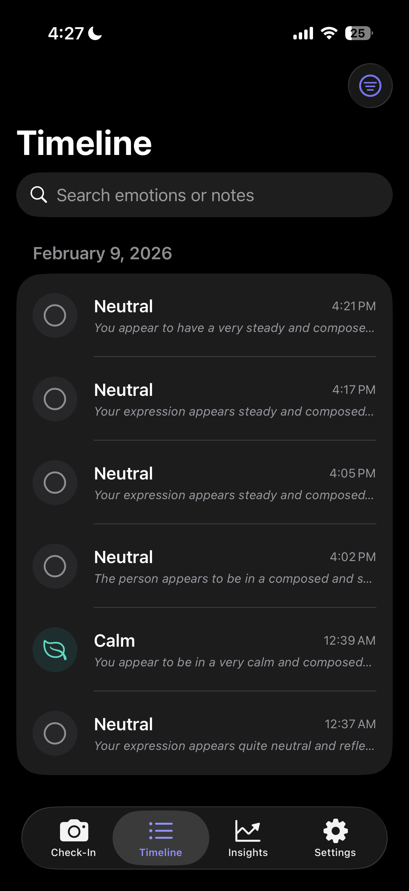
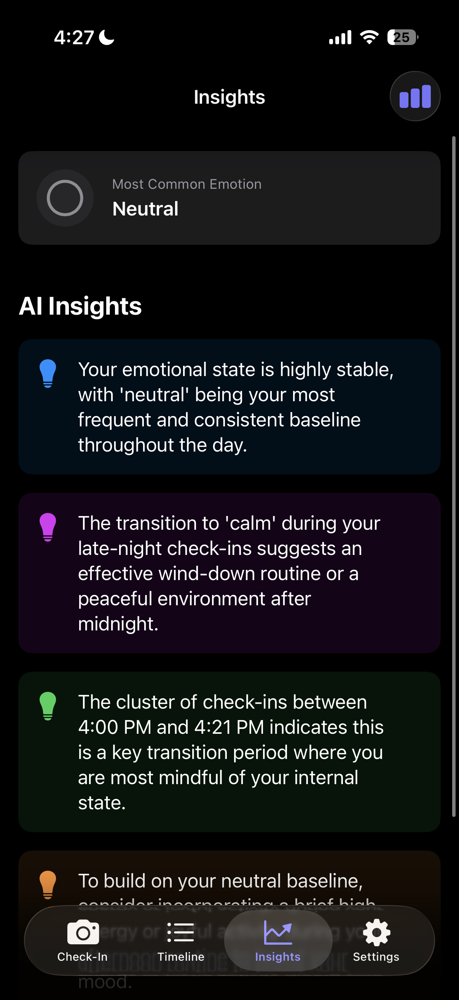
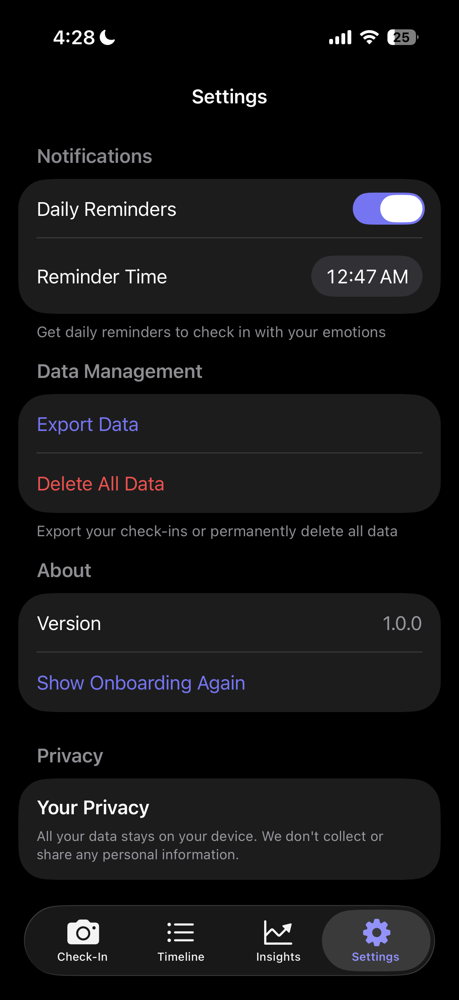

# MoodMirror 🪞

AI-powered emotion tracking app that uses your camera, voice, and Google's Gemini AI to help you understand your emotional patterns.

---

## 🤖 Gemini 3 Integration

MoodMirror leverages **Google's Gemini 3 API** (`gemini-3-flash-preview`) as its core intelligence engine for multimodal emotion analysis. The app sends three distinct data streams to Gemini in a single API call:

1. **Visual Analysis** - A base64-encoded selfie image is sent directly to Gemini's vision capabilities, allowing the model to detect facial expressions, micro-expressions, and emotional cues that traditional computer vision might miss.

2. **Voice Sentiment** - Audio recordings are transcribed using Apple's Speech framework, then the transcription text along with detected vocal patterns (pace, pauses) are analyzed by Gemini for emotional undertones.

3. **Contextual Notes** - User-provided text notes give Gemini additional context to provide more accurate emotional assessments.

Gemini synthesizes all three inputs to return a structured JSON response containing: primary emotion classification, confidence scores across 8 emotion categories (joy, sadness, anger, fear, surprise, disgust, trust, anticipation), and personalized AI insights. The model's advanced reasoning capabilities enable it to identify emotional patterns across multiple check-ins, providing users with actionable mental health insights over time.

---

## 🏗 Architecture

```
┌─────────────────────────────────────────────────────────────────┐
│                        MoodMirror App                           │
├─────────────────────────────────────────────────────────────────┤
│  ┌─────────────┐  ┌─────────────┐  ┌─────────────┐              │
│  │   Camera    │  │    Voice    │  │    Notes    │              │
│  │  (Vision)   │  │  (Speech)   │  │   (Text)    │              │
│  └──────┬──────┘  └──────┬──────┘  └──────┬──────┘              │
│         │                │                │                      │
│         └────────────────┼────────────────┘                      │
│                          ▼                                       │
│              ┌───────────────────────┐                          │
│              │   GeminiService       │                          │
│              │  (Multimodal Request) │                          │
│              └───────────┬───────────┘                          │
│                          │                                       │
└──────────────────────────┼───────────────────────────────────────┘
                           ▼
              ┌───────────────────────┐
              │   Gemini 3 Flash API  │
              │ (gemini-3-flash-preview)│
              └───────────┬───────────┘
                          │
                          ▼
              ┌───────────────────────┐
              │   EmotionAnalysis     │
              │  - Primary Emotion    │
              │  - Confidence Scores  │
              │  - AI Insights        │
              └───────────────────────┘
```

---

## ✨ Features

- **📸 Facial Expression Analysis** - Capture a selfie and let AI analyze your emotional state
- **🎤 Voice Sentiment Analysis** - Record how you're feeling and get tone-based insights
- **📝 Personal Notes** - Add context to your check-ins
- **📊 Timeline View** - Track your emotional journey over time
- **🤖 AI-Powered Insights** - Get personalized insights and patterns from Gemini AI
- **🔔 Daily Reminders** - Optional notifications to check in with yourself
- **🔒 Privacy-First** - All data stored locally on your device

## 🎥 Demo Video

[](https://www.youtube.com/watch?v=qwmWwceFU2A)

👆 Click to watch the demo on YouTube

## 📱 Screenshots

<p align="center">
  
  
  
  
</p>

| Check-in | Timeline | AI Insights | Settings |
|----------|----------|-------------|----------|
| Start emotion analysis | View history | Gemini-powered patterns | Privacy controls |

## 🛠 Requirements

- iOS 17.0+
- Xcode 15.0+
- Google Gemini API Key ([Get one free](https://makersuite.google.com/app/apikey))

## 🚀 Quick Start

### 1. Clone the repository
```bash
git clone https://github.com/Mohib1402/MoodMirror.git
cd MoodMirror
```

### 2. Configure your API Key

Create a `.env` file in the project root:
```bash
cp .env.example .env
```

Edit `.env` and add your Gemini API key:
```
GEMINI_API_KEY=your_api_key_here
```

### 3. Open in Xcode
```bash
open MoodMirror.xcodeproj
```

### 4. Build and Run
- Select your target device or simulator
- Press `Cmd + R` to build and run

## 🔑 API Key Setup

1. Go to [Google AI Studio](https://makersuite.google.com/app/apikey)
2. Create a new API key
3. Add it to your `.env` file (never commit this file!)

## 🏗 Tech Stack

| Technology | Purpose |
|------------|---------|
| SwiftUI | Modern declarative UI |
| Core Data | Local data persistence |
| AVFoundation | Camera & audio capture |
| Vision Framework | Face detection |
| Speech Framework | Voice transcription |
| Gemini API | AI emotion analysis |

## 📁 Project Structure

```
MoodMirror/
├── MoodMirror/
│   ├── Core/
│   │   ├── Models/          # Data models
│   │   ├── Services/        # API & business logic
│   │   └── Managers/        # System managers
│   ├── Features/
│   │   ├── CheckIn/         # Emotion check-in flow
│   │   ├── Timeline/        # History view
│   │   ├── Insights/        # AI insights
│   │   ├── Settings/        # App settings
│   │   └── Onboarding/      # First-run experience
│   └── Shared/              # Reusable components
└── MoodMirrorTests/         # Unit tests
```

## 🔒 Privacy

MoodMirror is designed with privacy in mind:
- All check-in data is stored locally on your device
- Photos are processed and immediately discarded after analysis
- Voice recordings are transcribed locally when possible
- No personal data is sent to external servers (except Gemini API for analysis)

See [PRIVACY_POLICY.md](PRIVACY_POLICY.md) for full details.

## 🧪 Testing

Run the test suite:
```bash
xcodebuild test -project MoodMirror.xcodeproj -scheme MoodMirror -destination 'platform=iOS Simulator,name=iPhone 15'
```

## 📄 License

MIT License - see LICENSE file for details.

## 🙏 Acknowledgments

Built for the **Google DeepMind Gemini 3 Hackathon** (December 2025 - February 2026).

Powered by [Google Gemini 3 API](https://ai.google.dev/).
